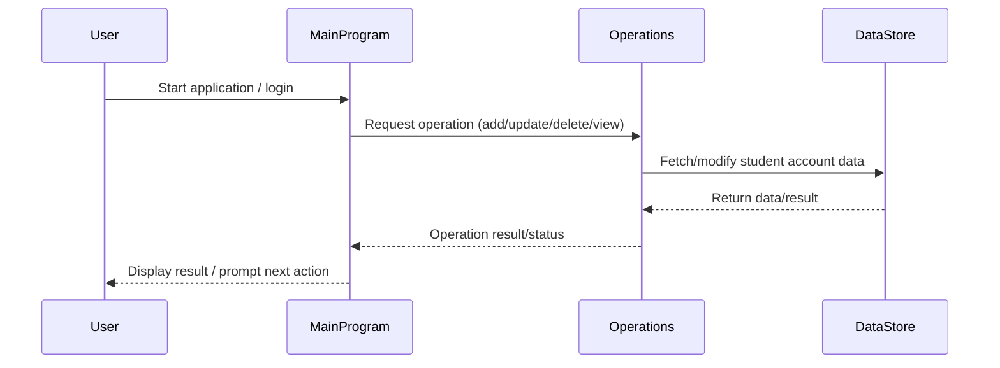

# COBOL Student Accounts System Documentation

This project contains COBOL source files for managing student accounts. Below is an overview of each file, its purpose, key functions, and business rules implemented.

## File Overview

### `main.cob`
- **Purpose:** Entry point for the student accounts system.
- **Key Functions:**
  - Initializes the program and sets up the environment.
  - Handles user input and directs workflow to appropriate operations.
- **Business Rules:**
  - Ensures only valid student account operations are processed.
  - Manages session control and error handling.

### `operations.cob`
- **Purpose:** Contains core business logic for student account operations.
- **Key Functions:**
  - Add, update, and delete student accounts.
  - Process transactions such as payments and adjustments.
  - Validate account data and enforce business rules.
- **Business Rules:**
  - Only authorized changes to student accounts are permitted.
  - Payment processing must follow institution guidelines.
  - Data validation ensures account integrity.

### `data.cob`
- **Purpose:** Defines data structures and storage for student accounts.
- **Key Functions:**
  - Declares record layouts for student account information.
  - Manages persistent storage and retrieval of account data.
- **Business Rules:**
  - Data formats must comply with legacy system requirements.
  - Student account records must be uniquely identifiable.

## Business Rules Summary
- Student accounts must be managed securely and accurately.
- All operations are subject to validation and error handling.
- Only authorized personnel may modify account data.
- Payment and transaction processing must adhere to institutional policies.

---
For further details, refer to the source code in the `src/cobol/` directory.

---

## Sequence Diagram: Student Accounts Data Flow

